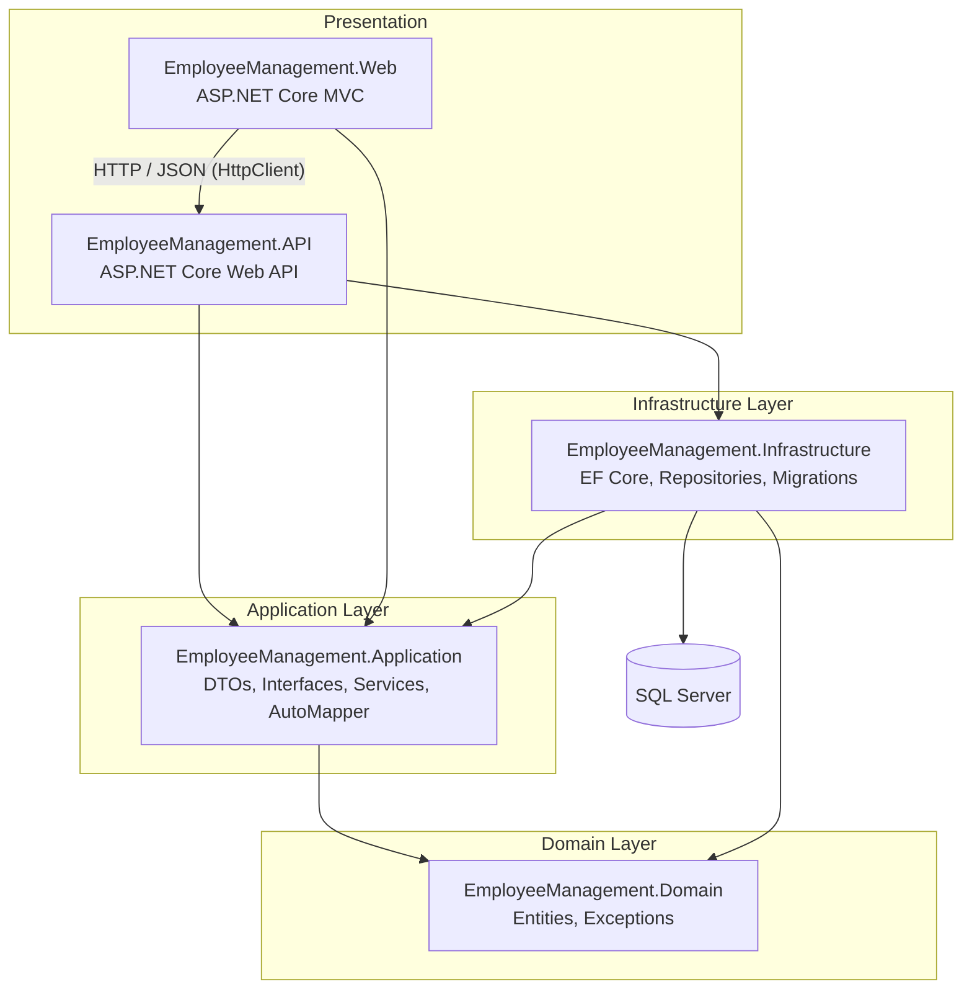
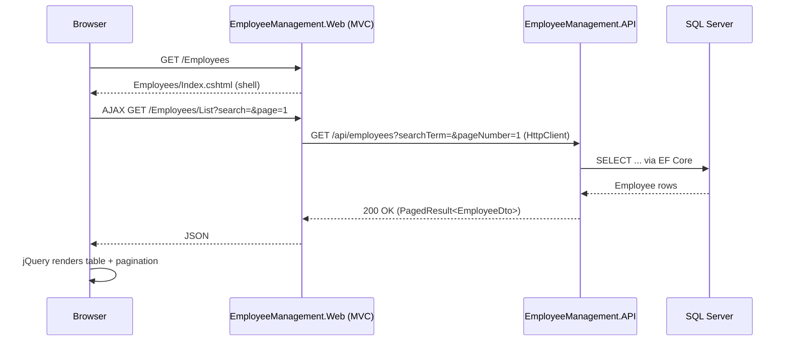
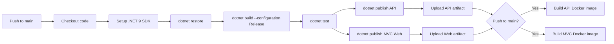

# Employee Management System

A production-ready **Employee Management System** built to demonstrate modern .NET development and DevOps practices end-to-end — Clean Architecture, a REST API, an MVC front-end, automated testing, containerization, and CI/CD — using **only free and open-source tooling**.

---

## Table of Contents

1. [Technology Stack](#technology-stack)
2. [Architecture](#architecture)
3. [Folder Structure](#folder-structure)
4. [Features](#features)
5. [How to Run](#how-to-run)
6. [Swagger Documentation](#swagger-documentation)
7. [Unit Testing](#unit-testing)
8. [Docker](#docker)
9. [CI/CD with GitHub Actions](#cicd-with-github-actions)
10. [Git & GitHub Workflow](#git--github-workflow)
11. [Screenshots](#screenshots)

---

## Technology Stack

| Layer      | Technology |
|------------|------------|
| Backend    | ASP.NET Core 9 Web API, Entity Framework Core 9, SQL Server (LocalDB / container) |
| Frontend   | ASP.NET Core MVC (.NET 9), Bootstrap 5, jQuery, AJAX |
| Docs       | Swagger / Swashbuckle |
| Mapping    | AutoMapper |
| Testing    | xUnit, Moq, EF Core InMemory |
| Containers | Docker, Docker Compose |
| CI/CD      | GitHub Actions (free tier) |
| IDE        | Visual Studio 2026 |

---

## Architecture

The solution follows **Clean Architecture**: dependencies always point inward, toward the Domain. The API and MVC Web projects are independent presentation layers that both depend on the Application layer; the MVC app never talks to the database directly — it calls the API over HTTP.



**Layer responsibilities**

- **Domain** — `Employee` entity, domain exceptions (`NotFoundException`, `ValidationException`). No dependencies on any other layer.
- **Application** — DTOs, `IEmployeeService` / `IEmployeeRepository` / `IAuthService` interfaces, service implementations, AutoMapper profiles. Depends only on Domain.
- **Infrastructure** — `ApplicationDbContext`, EF Core configurations, `EmployeeRepository`, migrations. Implements Application's interfaces.
- **API** — REST controllers, Swagger, global exception middleware, DI composition root for the API host.
- **Web** — MVC controllers/views calling the API through a typed `HttpClient`, cookie-based demo authentication, Bootstrap/jQuery/AJAX UI.
- **Tests** — xUnit tests for services and repositories, using Moq and the EF Core InMemory provider.

### Request flow example — loading the Employees page



---

## Folder Structure

Follows standard Microsoft conventions with `src/` for application code and `tests/` for test projects.

```
EmployeeManagementAPI/
├── EmployeeManagement.slnx              # Solution file
├── docker-compose.yml
├── .dockerignore
├── .gitignore
├── README.md
├── .github/
│   └── workflows/
│       └── ci-cd.yml                    # GitHub Actions pipeline
├── docker/
│   ├── Dockerfile.api                   # Multi-stage build for the API
│   └── Dockerfile.web                   # Multi-stage build for the MVC app
├── src/
│   ├── EmployeeManagement.Domain/
│   │   ├── Common/BaseEntity.cs
│   │   ├── Entities/Employee.cs
│   │   └── Exceptions/                  # NotFoundException, ValidationException
│   ├── EmployeeManagement.Application/
│   │   ├── Common/                      # PagedResult<T>, ApiErrorResponse
│   │   ├── DTOs/                        # EmployeeDto, Create/UpdateEmployeeDto, Login DTOs
│   │   ├── Interfaces/                  # IEmployeeRepository, IEmployeeService, IAuthService
│   │   ├── Mappings/MappingProfile.cs   # AutoMapper profile
│   │   ├── Services/                    # EmployeeService, AuthService
│   │   └── DependencyInjection.cs
│   ├── EmployeeManagement.Infrastructure/
│   │   ├── Persistence/                 # ApplicationDbContext, Migrations
│   │   ├── Configurations/              # EF Core entity configuration + seed data
│   │   ├── Repositories/EmployeeRepository.cs
│   │   └── DependencyInjection.cs
│   ├── EmployeeManagement.API/
│   │   ├── Controllers/                 # EmployeesController, AuthController
│   │   ├── Middleware/                  # GlobalExceptionMiddleware
│   │   ├── Properties/launchSettings.json
│   │   ├── appsettings.json / appsettings.Development.json
│   │   └── Program.cs
│   └── EmployeeManagement.Web/
│       ├── Controllers/                 # Account, Home (Dashboard), Employees
│       ├── Services/                    # EmployeeApiClient, AuthApiClient (typed HttpClient)
│       ├── Models/                      # LoginViewModel, DashboardViewModel
│       ├── Views/                       # Account/Login, Home/Index, Employees/*
│       ├── wwwroot/js/                  # site.js, employees.js (AJAX + toasts)
│       ├── Properties/launchSettings.json
│       ├── appsettings.json / appsettings.Development.json
│       └── Program.cs
└── tests/
    └── EmployeeManagement.Tests/
        ├── Services/                    # EmployeeServiceTests, AuthServiceTests
        ├── Repositories/                # EmployeeRepositoryTests (EF InMemory)
        └── Common/                      # PagedResultTests
```

---

## Features

- **Login** — simple demo authentication (`admin` / `Admin@123`) backed by a cookie scheme in the MVC app and validated against the API.
- **Dashboard** — total/active/inactive employee counts, department breakdown, average salary.
- **Employee List** — searchable, filterable (by department), paginated table rendered via AJAX.
- **Add / Edit / Delete Employee** — AJAX form submissions with client + server-side validation and Bootstrap toast notifications.
- **Global exception handling** — a single middleware in the API maps domain exceptions to consistent HTTP responses (404 for not found, 400 for validation errors, 500 otherwise).
- **Structured logging** via `ILogger` throughout the Application and API layers.
- **Responsive UI** — Bootstrap 5 grid and components.

---

## How to Run

### Prerequisites

- [.NET 9 SDK](https://dotnet.microsoft.com/download/dotnet/9.0)
- SQL Server LocalDB (installed with Visual Studio) **or** Docker Desktop
- Visual Studio 2026 (recommended) or any editor with C# support

### Option A — Run locally with Visual Studio / CLI (LocalDB)

```bash
# Restore & build
dotnet restore EmployeeManagement.slnx
dotnet build EmployeeManagement.slnx

# Run the API (applies EF Core migrations automatically on startup)
dotnet run --project src/EmployeeManagement.API

# In a second terminal, run the MVC web app
dotnet run --project src/EmployeeManagement.Web
```

- API Swagger UI: `https://localhost:7167/swagger`
- Web app: `https://localhost:7270`
- Demo login: **admin** / **Admin@123**

> The API calls `dbContext.Database.Migrate()` on startup, so the `EmployeeManagementDb` LocalDB database and seed data are created automatically — no manual `dotnet ef database update` step required for local development.

### Option B — Run everything with Docker Compose (recommended for a full demo)

```bash
docker compose up --build
```

- Web app: `http://localhost:8081`
- API + Swagger: `http://localhost:8080/swagger`
- SQL Server: `localhost:1433` (sa / `YourStrong@Passw0rd`)

Stop and remove containers:

```bash
docker compose down
```

Stop and also remove the SQL Server data volume (fresh database next run):

```bash
docker compose down -v
```

---

## Swagger Documentation

The API exposes interactive Swagger/OpenAPI documentation via Swashbuckle:

- Local: `https://localhost:7167/swagger`
- Docker: `http://localhost:8080/swagger`

It documents every endpoint on `EmployeesController` (`GET/POST/PUT/DELETE /api/employees`) and `AuthController` (`POST /api/auth/login`), including request/response schemas and status codes, and can be used to exercise the API directly without the MVC front-end.

---

## Unit Testing

The `EmployeeManagement.Tests` project uses **xUnit**, **Moq**, and the **EF Core InMemory** provider:

- `Services/EmployeeServiceTests.cs` — CRUD behavior, not-found/validation exception paths, mocked `IEmployeeRepository`.
- `Services/AuthServiceTests.cs` — demo login success/failure/case-insensitivity.
- `Repositories/EmployeeRepositoryTests.cs` — search, department filter, pagination, and unique-email checks against an in-memory EF Core database.
- `Common/PagedResultTests.cs` — pagination math (`TotalPages`, `HasNextPage`, `HasPreviousPage`).

Run all tests:

```bash
dotnet test EmployeeManagement.slnx
```

---

## Docker

Two independent multi-stage Dockerfiles live in `docker/`:

- **`docker/Dockerfile.api`** — builds and publishes `EmployeeManagement.API`, runs on the ASP.NET Core runtime image as a non-root user, exposes port `8080`, and defines a `/health` container health check.
- **`docker/Dockerfile.web`** — builds and publishes `EmployeeManagement.Web` the same way, exposes port `8080` internally (mapped to host `8081`).

`docker-compose.yml` wires up three services on a shared bridge network (`employeemanagement-network`):

| Service     | Image / Build                 | Host Port | Notes |
|-------------|--------------------------------|-----------|-------|
| `sqlserver` | `mcr.microsoft.com/mssql/server:2022-latest` | `1433` | Persists data in the `sqlserver-data` volume; has a `sqlcmd`-based health check. |
| `api`       | `docker/Dockerfile.api`        | `8080`    | Waits for SQL Server to be healthy, applies EF Core migrations on startup, connects using the `sqlserver` service name. |
| `web`       | `docker/Dockerfile.web`        | `8081`    | Waits for the API to be healthy; calls it internally at `http://api:8080/` — the browser never talks to the API directly. |

**All three services communicate over the internal Docker network** (`employeemanagement-network`): the Web container reaches the API by its service name (`api`), and the API reaches the database by its service name (`sqlserver`); host port mappings exist only so you can browse the app and hit Swagger from outside the network.

### Useful Docker Commands

```bash
# Build and start all services in the foreground
docker compose up --build

# Start in detached mode
docker compose up -d --build

# View logs for a specific service
docker compose logs -f api

# Rebuild a single service
docker compose build web

# Stop all services
docker compose down

# Stop and wipe the SQL Server volume
docker compose down -v

# Build a single image manually
docker build -f docker/Dockerfile.api -t employeemanagement-api .
```

---

## CI/CD with GitHub Actions

`.github/workflows/ci-cd.yml` runs automatically **on every push to `main`** (and on pull requests targeting `main`), using only free, GitHub-hosted `ubuntu-latest` runners and official GitHub Actions.



**Job 1 — `build-test-publish`** (runs on every push/PR to `main`):
1. Checkout the repository.
2. Install the .NET 9 SDK.
3. `dotnet restore` the solution.
4. `dotnet build` in `Release` configuration.
5. `dotnet test` and upload the `.trx` results as an artifact.
6. `dotnet publish` the API and the MVC Web app separately.
7. Upload both published outputs as downloadable build artifacts (`employeemanagement-api`, `employeemanagement-web`).

**Job 2 — `build-docker-images`** (runs only on pushes to `main`, after Job 1 succeeds):
1. Set up Docker Buildx.
2. Build the API image from `docker/Dockerfile.api`.
3. Build the MVC image from `docker/Dockerfile.web`.

Images are built (not pushed) in this demo pipeline to keep everything within GitHub's free tier — pushing to a registry (Docker Hub, GHCR) can be added by uncommenting/adding a login + push step once you have registry credentials.

---

## Git & GitHub Workflow

### Initial setup (already done in this repository)

```bash
git init
git add .
git commit -m "Initial commit: Employee Management System (Clean Architecture)"
```

### Day-to-day workflow

```bash
# Create a feature branch
git checkout -b feature/employee-search

# Stage and commit changes
git add .
git commit -m "Add department filter to employee search"

# Push the branch and open a pull request
git push -u origin feature/employee-search

# After review, merge into main via a pull request on GitHub —
# this automatically triggers the CI/CD pipeline defined in ci-cd.yml
```

### Recommended branch strategy

- `main` — always deployable; protected; every push triggers CI/CD.
- `feature/*` — one branch per feature or fix; opened as a pull request into `main`.

### Common Git commands used in this project

| Command | Purpose |
|---------|---------|
| `git status` | Check working tree state |
| `git add <file>` | Stage changes |
| `git commit -m "message"` | Record a change |
| `git log --oneline --graph` | Inspect history |
| `git checkout -b <branch>` | Create and switch to a new branch |
| `git push -u origin <branch>` | Push a new branch and set upstream |
| `git pull` | Sync local branch with remote |
| `git merge <branch>` | Merge another branch into the current one |

---

## Screenshots

> Add screenshots of the running application here after your first local or Docker run.

| Page | Screenshot |
|------|------------|
| Login | `docs/screenshots/login.png` |
| Dashboard | `docs/screenshots/dashboard.png` |
| Employee List | `docs/screenshots/employee-list.png` |
| Add Employee | `docs/screenshots/add-employee.png` |
| Swagger UI | `docs/screenshots/swagger.png` |

---

## License

This project is provided as a demonstration of DevOps and Clean Architecture practices and is free to use for learning purposes.
