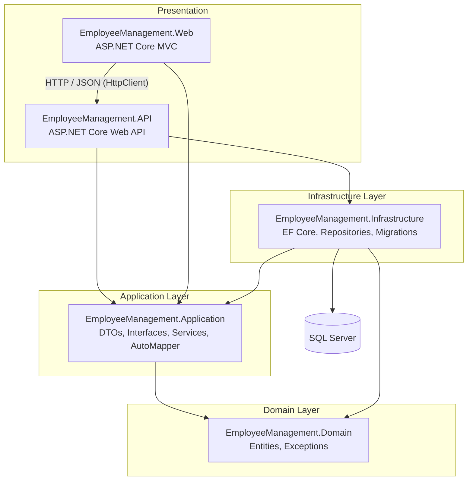
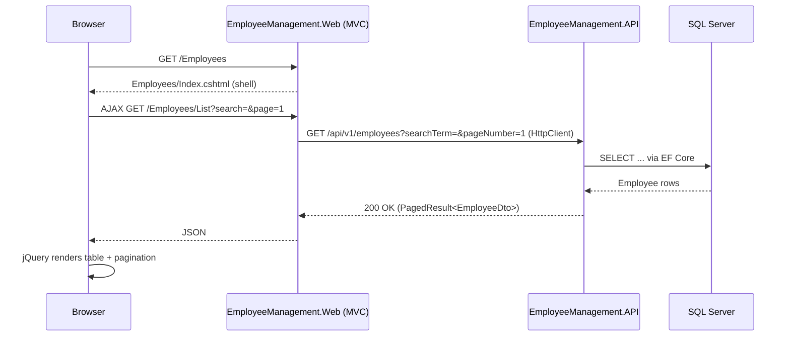
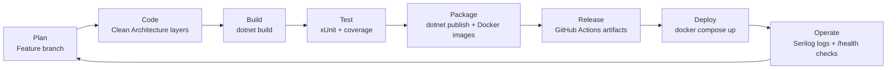
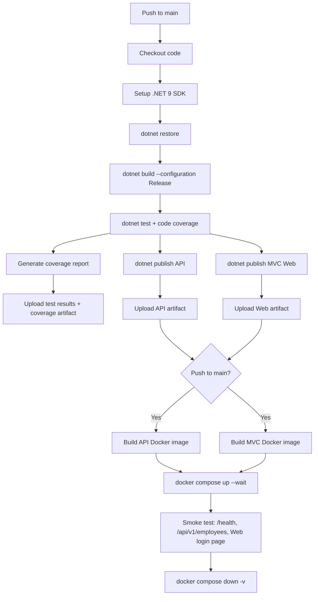
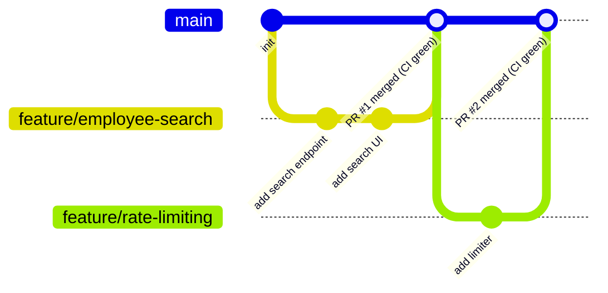

# Employee Management System

[](https://github.com/popuri2000/employee-management-devops-demo/actions/workflows/ci-cd.yml)

A production-ready **Employee Management System** built to demonstrate modern .NET development and DevOps practices end-to-end — Clean Architecture, a REST API, an MVC front-end, automated testing, containerization, and CI/CD — using **only free and open-source tooling**.

---

## Project Objectives

This repository exists to demonstrate, in one runnable codebase, the practices a small engineering team is expected to know:

- Structuring a real ASP.NET Core solution with **Clean Architecture** instead of a single monolithic project.
- Separating a REST API from its consuming front-end, so either can be replaced or scaled independently.
- Writing automated tests that survive refactors (mocked services + an in-memory database, not brittle end-to-end-only tests).
- Shipping the same artifact to a developer's laptop (LocalDB) and to containers (Docker Compose) without code changes — only configuration changes.
- Automating build/test/publish with CI so "it works on my machine" is caught before merge.
- Doing all of the above with **zero paid services**: GitHub Actions free tier, Docker Desktop, SQL Server Developer edition, and open-source NuGet packages only.

---

## Table of Contents

1. [Project Objectives](#project-objectives)
2. [Technology Stack](#technology-stack)
3. [Architecture](#architecture)
4. [DevOps Lifecycle](#devops-lifecycle)
5. [Folder Structure](#folder-structure)
6. [Features](#features)
7. [How to Run](#how-to-run)
8. [Swagger Documentation](#swagger-documentation)
9. [Unit Testing & Code Coverage](#unit-testing--code-coverage)
10. [Docker](#docker)
11. [CI/CD with GitHub Actions](#cicd-with-github-actions)
12. [Git & GitHub Workflow](#git--github-workflow)
13. [Screenshots](#screenshots)
14. [Future Enhancements](#future-enhancements)
15. [Lessons Learned](#lessons-learned)

---

## Technology Stack

| Layer          | Technology |
|----------------|------------|
| Backend        | ASP.NET Core 9 Web API, Entity Framework Core 9, SQL Server (LocalDB / container) |
| Frontend       | ASP.NET Core MVC (.NET 9), Bootstrap 5, jQuery, AJAX |
| API Docs       | Swagger / Swashbuckle, with API versioning (`Asp.Versioning`) |
| Resilience     | ASP.NET Core built-in rate limiting (fixed window) |
| Mapping        | AutoMapper |
| Logging        | Serilog (console + rolling file sinks), request logging middleware |
| Testing        | xUnit, Moq, EF Core InMemory, Coverlet + ReportGenerator for coverage |
| Containers     | Docker, Docker Compose |
| CI/CD          | GitHub Actions (free tier) |
| IDE            | Visual Studio 2026 |

---

## Architecture

The solution follows **Clean Architecture**: dependencies always point inward, toward the Domain. The API and MVC Web projects are independent presentation layers that both depend on the Application layer; the MVC app never talks to the database directly — it calls the API over HTTP.



**Layer responsibilities**

- **Domain** — `Employee` entity, domain exceptions (`NotFoundException`, `ValidationException`). No dependencies on any other layer.
- **Application** — DTOs, `IEmployeeService` / `IEmployeeRepository` / `IAuthService` interfaces, service implementations, AutoMapper profiles. Depends only on Domain.
- **Infrastructure** — `ApplicationDbContext`, EF Core configurations, `EmployeeRepository`, migrations. Implements Application's interfaces.
- **API** — REST controllers, Swagger, global exception middleware, DI composition root for the API host.
- **Web** — MVC controllers/views calling the API through a typed `HttpClient`, cookie-based demo authentication, Bootstrap/jQuery/AJAX UI.
- **Tests** — xUnit tests for services and repositories, using Moq and the EF Core InMemory provider.

### Request flow example — loading the Employees page



---

## DevOps Lifecycle

How the pieces in this repository map onto a standard DevOps lifecycle:



- **Plan / Code** — work happens on a `feature/*` branch against the layered solution described above.
- **Build** — `dotnet build` on every push/PR via GitHub Actions; fails fast on compile errors.
- **Test** — `dotnet test` with Coverlet code coverage collection; results and an HTML coverage report are uploaded as build artifacts.
- **Package** — `dotnet publish` produces deployable output for both the API and MVC app; Docker images are built from the same source on pushes to `main`.
- **Release** — GitHub Actions artifacts (`employeemanagement-api`, `employeemanagement-web`, `test-results`) are downloadable from the Actions run.
- **Deploy** — `docker compose up` brings up SQL Server, the API, and the MVC app together, wired on one Docker network.
- **Operate** — Serilog writes structured logs to console and rolling files; `/health` gives container orchestrators a liveness signal; the built-in rate limiter protects the API from accidental overload.

---

## Folder Structure

Follows standard Microsoft conventions with `src/` for application code and `tests/` for test projects.

```
EmployeeManagementAPI/
├── EmployeeManagement.slnx              # Solution file
├── docker-compose.yml
├── .dockerignore
├── .gitignore
├── README.md
├── .github/
│   └── workflows/
│       └── ci-cd.yml                    # GitHub Actions pipeline
├── docker/
│   ├── Dockerfile.api                   # Multi-stage build for the API
│   └── Dockerfile.web                   # Multi-stage build for the MVC app
├── src/
│   ├── EmployeeManagement.Domain/
│   │   ├── Common/BaseEntity.cs
│   │   ├── Entities/Employee.cs
│   │   └── Exceptions/                  # NotFoundException, ValidationException
│   ├── EmployeeManagement.Application/
│   │   ├── Common/                      # PagedResult<T>, ApiErrorResponse
│   │   ├── DTOs/                        # EmployeeDto, Create/UpdateEmployeeDto, Login DTOs
│   │   ├── Interfaces/                  # IEmployeeRepository, IEmployeeService, IAuthService
│   │   ├── Mappings/MappingProfile.cs   # AutoMapper profile
│   │   ├── Services/                    # EmployeeService, AuthService
│   │   └── DependencyInjection.cs
│   ├── EmployeeManagement.Infrastructure/
│   │   ├── Persistence/                 # ApplicationDbContext, Migrations
│   │   ├── Configurations/              # EF Core entity configuration + seed data
│   │   ├── Repositories/EmployeeRepository.cs
│   │   └── DependencyInjection.cs
│   ├── EmployeeManagement.API/
│   │   ├── Controllers/                 # EmployeesController, AuthController (versioned api/v1/*)
│   │   ├── Middleware/                  # GlobalExceptionMiddleware
│   │   ├── Properties/launchSettings.json
│   │   ├── appsettings.json / appsettings.Development.json / appsettings.Production.json
│   │   └── Program.cs                   # Serilog, API versioning, rate limiting, Swagger, CORS
│   └── EmployeeManagement.Web/
│       ├── Controllers/                 # Account, Home (Dashboard), Employees
│       ├── Services/                    # EmployeeApiClient, AuthApiClient (typed HttpClient)
│       ├── Models/                      # LoginViewModel, DashboardViewModel
│       ├── Views/                       # Account/Login, Home/Index, Employees/*
│       ├── wwwroot/js/                  # site.js, employees.js (AJAX + toasts)
│       ├── Properties/launchSettings.json
│       ├── appsettings.json / appsettings.Development.json / appsettings.Production.json
│       └── Program.cs                   # Serilog, cookie auth
└── tests/
    └── EmployeeManagement.Tests/
        ├── Services/                    # EmployeeServiceTests, AuthServiceTests
        ├── Repositories/                # EmployeeRepositoryTests (EF InMemory)
        ├── Common/                      # PagedResultTests
        └── coverlet.runsettings         # Excludes generated EF migrations from coverage
```

---

## Features

- **Login** — simple demo authentication (`admin` / `Admin@123`) backed by a cookie scheme in the MVC app and validated against the API.
- **Dashboard** — total/active/inactive employee counts, department breakdown, average salary.
- **Employee List** — searchable, filterable (by department), paginated table rendered via AJAX.
- **Add / Edit / Delete Employee** — AJAX form submissions with client + server-side validation and Bootstrap toast notifications.
- **Global exception handling** — a single middleware in the API maps domain exceptions to consistent HTTP responses (404 for not found, 400 for validation errors, 500 otherwise).
- **API versioning** — routes are versioned (`/api/v1/...`) via `Asp.Versioning`, so future breaking changes can ship as `v2` without touching existing clients.
- **Rate limiting** — a fixed-window limiter (100 requests/minute per policy, with queuing) protects the API from accidental overload; returns `429 Too Many Requests` when exceeded.
- **Structured logging** — Serilog writes structured, leveled logs to the console and to rolling daily files (`logs/`) in both the API and the MVC app, including per-request logging.
- **Responsive UI** — Bootstrap 5 grid and components.

---

## How to Run

### Prerequisites

- [.NET 9 SDK](https://dotnet.microsoft.com/download/dotnet/9.0)
- SQL Server LocalDB (installed with Visual Studio) **or** Docker Desktop
- Visual Studio 2026 (recommended) or any editor with C# support

### Option A — Run locally with Visual Studio / CLI (LocalDB)

```bash
# Restore & build
dotnet restore EmployeeManagement.slnx
dotnet build EmployeeManagement.slnx

# Run the API (applies EF Core migrations automatically on startup)
dotnet run --project src/EmployeeManagement.API

# In a second terminal, run the MVC web app
dotnet run --project src/EmployeeManagement.Web
```

- API Swagger UI: `https://localhost:7167/swagger`
- Web app: `https://localhost:7270`
- Demo login: **admin** / **Admin@123**

> The API calls `dbContext.Database.Migrate()` on startup, so the `EmployeeManagementDb` LocalDB database and seed data are created automatically — no manual `dotnet ef database update` step required for local development.

### Option B — Run everything with Docker Compose (recommended for a full demo)

```bash
docker compose up --build
```

- Web app: `http://localhost:8081`
- API + Swagger: `http://localhost:8080/swagger`
- SQL Server: `localhost:1433` (sa / `YourStrong@Passw0rd`)

Stop and remove containers:

```bash
docker compose down
```

Stop and also remove the SQL Server data volume (fresh database next run):

```bash
docker compose down -v
```

---

## Swagger Documentation

The API exposes interactive Swagger/OpenAPI documentation via Swashbuckle:

- Local: `https://localhost:7167/swagger`
- Docker: `http://localhost:8080/swagger`

It documents every endpoint on `EmployeesController` (`GET/POST/PUT/DELETE /api/v1/employees`) and `AuthController` (`POST /api/v1/auth/login`), including request/response schemas and status codes, and can be used to exercise the API directly without the MVC front-end. All routes are versioned (`v1` today) via `Asp.Versioning`, so the Swagger document and route table will grow additional versions side by side if breaking changes are introduced later.

---

## Unit Testing & Code Coverage

The `EmployeeManagement.Tests` project uses **xUnit**, **Moq**, and the **EF Core InMemory** provider — 25 tests in total:

- `Services/EmployeeServiceTests.cs` — CRUD behavior, not-found/validation exception paths, mocked `IEmployeeRepository`.
- `Services/AuthServiceTests.cs` — demo login success/failure/case-insensitivity.
- `Repositories/EmployeeRepositoryTests.cs` — search, department filter, pagination, and unique-email checks against an in-memory EF Core database.
- `Common/PagedResultTests.cs` — pagination math (`TotalPages`, `HasNextPage`, `HasPreviousPage`).

Run all tests:

```bash
dotnet test EmployeeManagement.slnx
```

### Code coverage

Coverage is collected with **Coverlet** (`--collect:"XPlat Code Coverage"`) and turned into an HTML/text report with **ReportGenerator**. Generated EF Core migration code is excluded via `tests/EmployeeManagement.Tests/coverlet.runsettings`, since it's scaffolded boilerplate rather than code worth unit testing.

```bash
# Collect coverage
dotnet test EmployeeManagement.slnx \
  --collect:"XPlat Code Coverage" \
  --settings tests/EmployeeManagement.Tests/coverlet.runsettings \
  --results-directory ./test-results

# Turn the .cobertura.xml into a browsable HTML report
dotnet tool install --global dotnet-reportgenerator-globaltool
reportgenerator "-reports:test-results/**/coverage.cobertura.xml" "-targetdir:test-results/coverage-report" "-reporttypes:Html;TextSummary"
```

At the time of writing, this covers **~86% of lines** across Domain/Application/Infrastructure (excluding migrations), with the Application layer (DTOs, services, mapping) close to 92%. The GitHub Actions pipeline runs the same commands automatically and publishes the report as a build artifact plus a summary in the workflow run.

---

## Docker

Two independent multi-stage Dockerfiles live in `docker/`:

- **`docker/Dockerfile.api`** — builds and publishes `EmployeeManagement.API`, runs on the ASP.NET Core runtime image as a non-root user, exposes port `8080`, and defines a `/health` container health check.
- **`docker/Dockerfile.web`** — builds and publishes `EmployeeManagement.Web` the same way, exposes port `8080` internally (mapped to host `8081`).

`docker-compose.yml` wires up three services on a shared bridge network (`employeemanagement-network`):

| Service     | Image / Build                 | Host Port | Notes |
|-------------|--------------------------------|-----------|-------|
| `sqlserver` | `mcr.microsoft.com/mssql/server:2022-latest` | `1433` | Persists data in the `sqlserver-data` volume; has a `sqlcmd`-based health check. |
| `api`       | `docker/Dockerfile.api`        | `8080`    | Waits for SQL Server to be healthy, applies EF Core migrations on startup, connects using the `sqlserver` service name. |
| `web`       | `docker/Dockerfile.web`        | `8081`    | Waits for the API to be healthy; calls it internally at `http://api:8080/` — the browser never talks to the API directly. |

**All three services communicate over the internal Docker network** (`employeemanagement-network`): the Web container reaches the API by its service name (`api`), and the API reaches the database by its service name (`sqlserver`); host port mappings exist only so you can browse the app and hit Swagger from outside the network.

### Useful Docker Commands

```bash
# Build and start all services in the foreground
docker compose up --build

# Start in detached mode
docker compose up -d --build

# View logs for a specific service
docker compose logs -f api

# Rebuild a single service
docker compose build web

# Stop all services
docker compose down

# Stop and wipe the SQL Server volume
docker compose down -v

# Build a single image manually
docker build -f docker/Dockerfile.api -t employeemanagement-api .
```

---

## CI/CD with GitHub Actions

`.github/workflows/ci-cd.yml` runs automatically **on every push to `main`** (and on pull requests targeting `main`), using only free, GitHub-hosted `ubuntu-latest` runners and official GitHub Actions.



**Job 1 — `build-test-publish`** (runs on every push/PR to `main`):
1. Checkout the repository.
2. Install the .NET 9 SDK.
3. `dotnet restore` the solution.
4. `dotnet build` in `Release` configuration.
5. `dotnet test` with Coverlet code coverage collection.
6. Generate an HTML/text coverage report with ReportGenerator and write a summary to the GitHub Actions run summary page.
7. Upload the `.trx` test results and coverage report as a build artifact.
8. `dotnet publish` the API and the MVC Web app separately.
9. Upload both published outputs as downloadable build artifacts (`employeemanagement-api`, `employeemanagement-web`).

**Job 2 — `build-docker-images`** (runs only on pushes to `main`, after Job 1 succeeds):
1. Set up Docker Buildx.
2. Build the API image from `docker/Dockerfile.api`.
3. Build the MVC image from `docker/Dockerfile.web`.

Images are built (not pushed) in this demo pipeline to keep everything within GitHub's free tier — pushing to a registry (Docker Hub, GHCR) can be added by uncommenting/adding a login + push step once you have registry credentials.

**Job 3 — `docker-compose-smoke-test`** (runs only on pushes to `main`, after Job 1 succeeds): this is what actually proves the three containers work together, not just that each image builds in isolation.
1. `docker compose up -d --build --wait` — builds and starts SQL Server, the API, and the MVC Web app on GitHub's runner, and blocks until all three containers report **healthy** (using the same health checks described in [Docker](#docker)).
2. Poll `http://localhost:8080/health` until the API responds.
3. Hit `http://localhost:8080/api/v1/employees` and assert the response actually contains employee data (i.e. the API successfully talked to SQL Server and ran its migrations).
4. Hit `http://localhost:8081/Account/Login` and assert the MVC Web container is serving pages.
5. Dump `docker compose logs` if anything failed, then always run `docker compose down -v` to tear the stack down cleanly.

This job runs on GitHub-hosted `ubuntu-latest` runners, which come with Docker and Compose v2 preinstalled — no self-hosted runner or paid add-on required.

---

## Git & GitHub Workflow

### Initial setup (already done in this repository)

```bash
git init
git add .
git commit -m "Initial commit: Employee Management System (Clean Architecture)"
```

### Day-to-day workflow

```bash
# Create a feature branch
git checkout -b feature/employee-search

# Stage and commit changes
git add .
git commit -m "Add department filter to employee search"

# Push the branch and open a pull request
git push -u origin feature/employee-search

# After review, merge into main via a pull request on GitHub —
# this automatically triggers the CI/CD pipeline defined in ci-cd.yml
```

### Recommended branch strategy (trunk-based, GitHub Flow)

This project uses a lightweight **GitHub Flow** rather than full Git Flow — one long-lived branch, short-lived feature branches, and every merge to `main` is deployable:



- `main` — always deployable; every push/merge triggers the full CI/CD pipeline. **Protected** in GitHub (Settings → Branches): a pull request is required, and `Restore, Build, Test & Publish`, `Build Docker Images`, and `Docker Compose Smoke Test` must all pass before merging.
- `feature/*` — one branch per feature or fix, opened as a pull request into `main`, merged only once CI is green.
- `fix/*` / `hotfix/*` — same flow as `feature/*`, used for bug fixes.

> **Note on admin bypass:** classic GitHub branch protection does not restrict repository admins by default — an admin can still push directly to a protected branch, and GitHub will report it as a *bypassed* rule violation rather than a hard rejection. To make the rule bind everyone including admins, enable **"Do not allow bypassing the above settings"** on the rule.

If your team needs longer release cycles or parallel release branches, this can be upgraded to full **Git Flow** (`develop`, `release/*`, `hotfix/*` branches) without changing anything else in this repo — only the branch-protection rules and the `on.push.branches` list in `ci-cd.yml` would need to change.

### Common Git commands used in this project

| Command | Purpose |
|---------|---------|
| `git status` | Check working tree state |
| `git add <file>` | Stage changes |
| `git commit -m "message"` | Record a change |
| `git log --oneline --graph` | Inspect history |
| `git checkout -b <branch>` | Create and switch to a new branch |
| `git push -u origin <branch>` | Push a new branch and set upstream |
| `git pull` | Sync local branch with remote |
| `git merge <branch>` | Merge another branch into the current one |

---

## Screenshots

> Add screenshots of the running application here after your first local or Docker run.

| Page | Screenshot |
|------|------------|
| Login | `docs/screenshots/login.png` |
| Dashboard | `docs/screenshots/dashboard.png` |
| Employee List | `docs/screenshots/employee-list.png` |
| Add Employee | `docs/screenshots/add-employee.png` |
| Swagger UI | `docs/screenshots/swagger.png` |

---

## Future Enhancements

Deliberately out of scope for this demo, but natural next steps for a real production system:

- **Real authentication** — replace the demo login with JWT bearer tokens issued by the API (or an external identity provider), with the MVC app attaching bearer tokens instead of using its own cookie scheme.
- **Push Docker images to a registry** — add a login + push step to `build-docker-images` (Docker Hub or GHCR, both free for public images) and deploy via `docker compose pull && docker compose up -d` on a target host.
- **Centralized log aggregation** — ship Serilog output to Seq, Loki, or the ELK stack instead of local rolling files, for multi-instance deployments.
- **Distributed caching** — cache frequently-read employee lookups (e.g., department reference data) with an in-memory or Redis cache.
- **Soft delete & audit trail** — track who changed what and when, instead of hard-deleting `Employee` rows.
- **Integration tests** — add a test project stage that spins up the API against a real (containerized) SQL Server using `Testcontainers`, complementing the current unit/EF-InMemory tests.
- **Fully enforce branch protection** — the three CI checks are already required on `main` (see [Git & GitHub Workflow](#git--github-workflow)); the remaining step is enabling "Do not allow bypassing" so it also binds repository admins, not just other contributors.

## Lessons Learned

Notes from building this out that are worth remembering the next time a similar solution is scaffolded:

- **Keep the browser out of CORS entirely when you can.** Routing all AJAX calls through the MVC server (which calls the API server-to-server) sidesteps CORS complexity altogether — the CORS policy on the API is still configured for completeness/documentation, but it's never actually exercised by a browser in this architecture.
- **`dotnet new` templates change between SDK versions.** This solution was scaffolded with the .NET 10 SDK targeting `net9.0`, which defaults to the newer `.slnx` solution format instead of `.sln` — all tooling (`dotnet build/test`, CI, IDEs) needs to accept that file directly.
- **AutoMapper's DI registration API is version-sensitive.** Recent AutoMapper versions require an explicit `ILoggerFactory` argument to `MapperConfiguration` and have moved away from the old `services.AddAutoMapper(assembly)` one-liner in some release combinations — check the installed version's actual constructor rather than assuming an older tutorial's syntax still compiles.
- **Exclude generated code from coverage metrics.** EF Core migrations are scaffolded, not authored — leaving them in coverage stats makes a well-tested codebase look far worse than it is (46% vs. ~86% in this repo) and can mislead a reviewer about actual test quality.
- **A container health check is more than a nicety.** Without `depends_on: condition: service_healthy` on the SQL Server and API containers, `docker compose up` would routinely race the API's EF Core migration step against SQL Server still booting — the health checks make container startup ordering deterministic instead of flaky.
- **"Builds a Docker image" and "the containers work together" are different claims.** The `build-docker-images` job only proves each Dockerfile builds in isolation. A separate `docker-compose-smoke-test` job that actually runs `docker compose up --wait` and hits real endpoints is what proves the SQL Server → API → Web wiring genuinely works — GitHub-hosted runners come with Docker preinstalled, so this costs nothing extra to add.
- **Classic branch protection doesn't bind repository admins by default.** A protected branch still accepts a direct push from an admin — GitHub reports it as a *bypassed* rule violation in the push output rather than rejecting it outright. Treat that log line as a signal the rule exists and is being evaluated, not proof it's actually blocking anyone; check "Do not allow bypassing" if the rule needs to apply to every account, including your own.
- **Never paste a Personal Access Token (or any credential) into a chat, ticket, or log.** Treat it exactly like a password — if one is ever pasted somewhere outside a proper secret store, revoke it immediately and issue a new one rather than trying to "clean up" the exposure after the fact.

---

## License

This project is provided as a demonstration of DevOps and Clean Architecture practices and is free to use for learning purposes.
